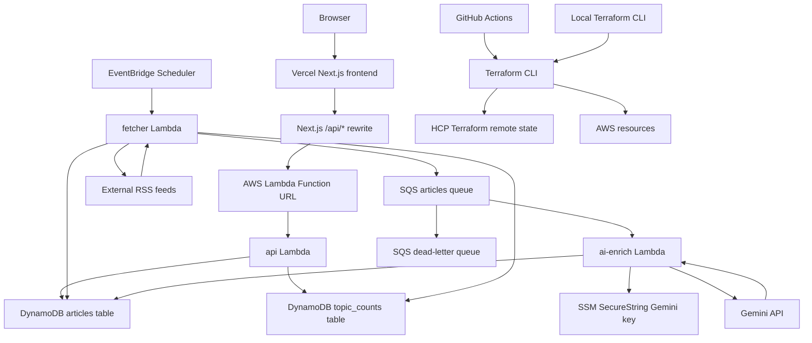
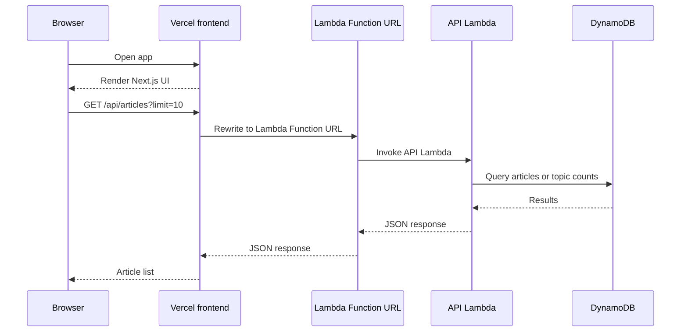
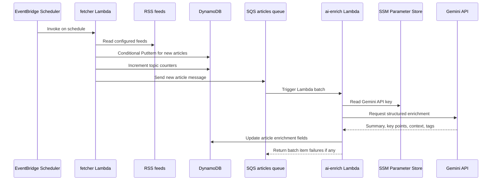
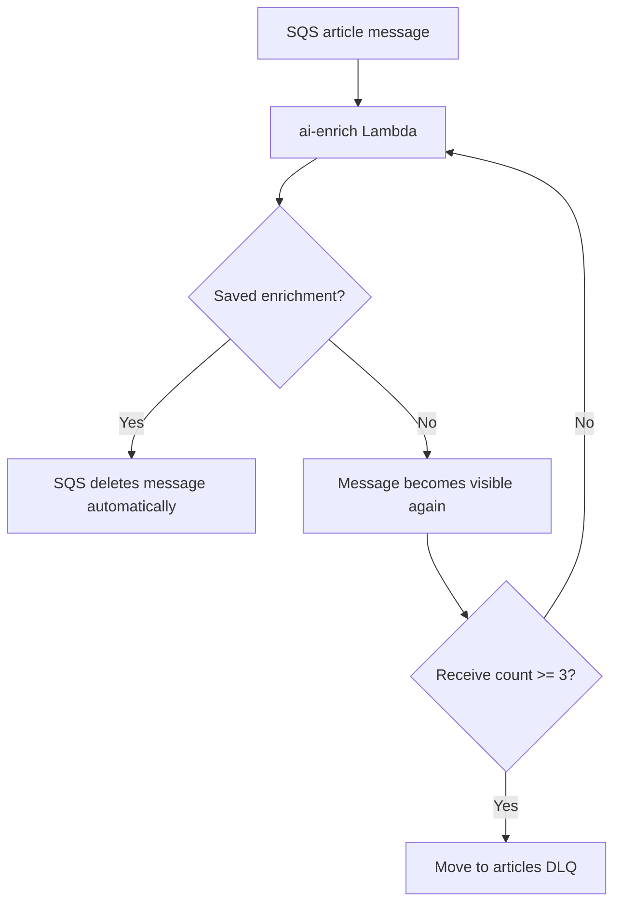
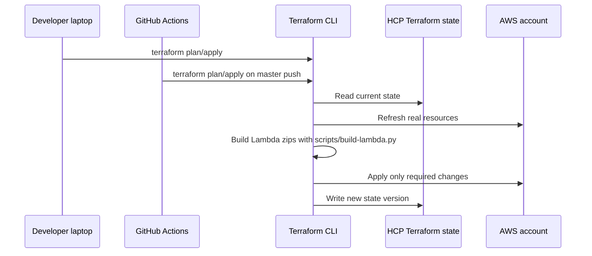

# newsagg AWS + Vercel cloud version

live at: [https://newsagg-front0.vercel.app/](https://newsagg-front0.vercel.app/)

This folder contains the cloud version of `newsagg`. It keeps the core idea of
the local k3d/Kubernetes project, but replaces the always-running local
infrastructure with serverless/free-tier-oriented services.

```text
Vercel Next.js frontend
  -> AWS Lambda Function URL
  -> Go API Lambda
  -> DynamoDB articles + topic counters

EventBridge Scheduler
  -> Go fetcher Lambda
  -> RSS feeds
  -> DynamoDB
  -> SQS articles queue
  -> Go ai-enrich Lambda
  -> Gemini API
  -> DynamoDB
```

## What Changed From The Local Version


| Local k3d version             | Cloud version                                        |
| ----------------------------- | ---------------------------------------------------- |
| k3d/Kubernetes manifests      | Terraform                                            |
| Next.js frontend pod          | Vercel project                                       |
| Go API pod                    | Go Lambda exposed by Lambda Function URL             |
| MongoDB                       | DynamoDB `articles` and `topic_counts` tables        |
| RabbitMQ `articles.new` queue | SQS articles queue and DLQ                           |
| Long-running fetcher pod      | EventBridge-scheduled Lambda                         |
| Long-running AI worker pod    | SQS-triggered Lambda                                 |
| Kubernetes secrets            | SSM Parameter Store, GitHub secrets, Vercel env vars |
| Local state                   | HCP Terraform remote state                           |


## Cloud Architecture




## Request Flow

The frontend does not call DynamoDB directly. It calls local `/api/*` routes,
and Next.js rewrites those requests to the public Lambda Function URL.




API endpoints:

```text
GET /health
GET /topics
GET /articles
GET /articles?topic=finance&limit=20&page=2
GET /articles/{id}
```

## Ingestion And Enrichment Flow




The current cloud fetcher writes directly to DynamoDB and then publishes to SQS
for enrichment. SQS is currently the enrichment queue, not a pre-DynamoDB ingest
buffer. If DynamoDB throttling becomes frequent, the next architectural upgrade
would be:

```text
fetcher Lambda -> SQS ingest queue -> writer Lambda -> DynamoDB -> SQS enrich queue
```

## Failure And Retry Behavior




- The Lambda event source mapping polls SQS automatically.
- The enrich Lambda returns `BatchItemFailures` for messages that should retry.
- Successful messages are deleted by the Lambda/SQS integration.
- Messages that fail repeatedly move to the DLQ.

## Terraform And State Flow

HCP Terraform stores remote state. Terraform still runs locally or in GitHub
Actions because the Lambda build step compiles local Go source code.




Editing `.tf` files does not change HCP state by itself. HCP state changes only
when Terraform commands such as `apply`, `import`, or `state rm/mv` write a new
state version.

## Folders

```text
frontend-vercel/   Next.js frontend deployed to Vercel
lambdas/api/       Go API Lambda: health, topics, articles
lambdas/fetcher/   Go scheduled RSS fetcher Lambda
lambdas/enrich/    Go SQS-triggered Gemini enrichment Lambda
terraform/         AWS infrastructure
scripts/           Cross-platform Python Lambda build helper
```

## Terraform Resources

The Terraform stack creates:

- DynamoDB `articles` table with feed/topic indexes.
- DynamoDB `topic_counts` table.
- SQS article queue and dead-letter queue.
- API, fetcher, and enrich Lambda functions.
- Public Lambda Function URL for the API.
- Lambda permissions required for public Function URL access.
- EventBridge Scheduler rule for the fetcher.
- SSM SecureString parameter for the Gemini key when configured.
- IAM roles and policies for Lambda and Scheduler.
- CloudWatch log groups.

See `[terraform/README.md](terraform/README.md)` for file-by-file Terraform
details.

## Local Terraform Deploy

Start with only API/database/frontend path if you are provisioning from zero:

```hcl
enable_fetch_schedule = false
enable_ai_enrichment  = false
gemini_api_key        = ""
```

Then run:

```powershell
cd aws-free-tier\terraform
Copy-Item terraform.tfvars.example terraform.tfvars
terraform login
terraform init
terraform validate
terraform plan
terraform apply
```

After apply:

```powershell
terraform output -raw api_function_url
```

Use that output in Vercel:

```text
API_GATEWAY_URL=https://your-lambda-url.lambda-url.us-east-1.on.aws
```

Deploy `aws-free-tier/frontend-vercel/` as the Vercel project root.

## Enable Background Work

Enable the fetcher first:

```hcl
enable_fetch_schedule = true
enable_ai_enrichment  = false
```

Then confirm articles are appearing:

```powershell
$api = terraform output -raw api_function_url
curl.exe "$api/topics"
curl.exe "$api/articles?limit=10&page=1"
```

After the fetcher is stable, enable AI enrichment:

```hcl
gemini_api_key        = "your-gemini-key"
enable_fetch_schedule = true
enable_ai_enrichment  = true
```

For stricter secret handling, create the Gemini key manually in SSM Parameter
Store and avoid putting the key in Terraform variables, because Terraform state
can retain sensitive values.

## GitHub Actions Deployment

The workflow is in:

```text
.github/workflows/aws-free-tier.yml
```

On pull requests to `master`, it runs:

```text
Go tests
Next.js lint/build for both frontends
Terraform fmt and validate
```

On pushes to `master`, it also runs `terraform apply`.

### Required GitHub Secrets

```text
TF_TOKEN_APP_TERRAFORM_IO
GEMINI_API_KEY
```

Use one AWS auth option:

```text
AWS_ROLE_TO_ASSUME
```

or:

```text
AWS_ACCESS_KEY_ID
AWS_SECRET_ACCESS_KEY
```

OIDC with `AWS_ROLE_TO_ASSUME` is preferred long-term because it avoids
long-lived AWS access keys.

### Required GitHub Variables

```text
ENABLE_FETCH_SCHEDULE=true
ENABLE_AI_ENRICHMENT=true
```

Optional variables:

```text
AWS_REGION=us-east-1
ALLOWED_CORS_ORIGINS=["*"]
```

The workflow requires the schedule/enrichment flags so a missing variable does
not silently disable running background work.

## Vercel Deployment

Create a Vercel project with:

```text
Root directory: aws-free-tier/frontend-vercel
Environment variable: API_GATEWAY_URL=<terraform api_function_url>
```

The Lambda URL should remain stable across normal `terraform apply` runs. It
changes only if the Function URL resource is destroyed/recreated, Terraform
state is lost, or the function/name identity is replaced.

## Cost And Free-Tier Notes

This stack is designed to stay small:

- Lambda is used for compute instead of always-running containers.
- DynamoDB uses provisioned capacity rather than large always-on databases.
- SQS replaces RabbitMQ without a server to manage.
- Lambdas stay outside a VPC to avoid NAT Gateway costs.
- HCP Terraform stores remote state without an S3 backend bucket.
- Vercel hosts the frontend outside AWS.

Always monitor AWS billing and usage alarms. "Free-tier-oriented" does not mean
unlimited.