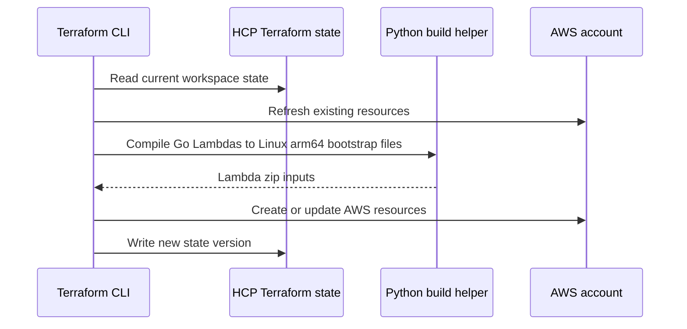

# Terraform stack

This folder provisions the AWS side of the cloud version.

Terraform uses the `cloud` block in `versions.tf` to store state in HCP
Terraform. The CLI still runs locally or in GitHub Actions because the stack
builds Lambda artifacts from local Go source before uploading them.

## What It Creates

```text
Lambda Function URL API
  -> DynamoDB articles table
  -> DynamoDB topic_counts table

EventBridge Scheduler
  -> fetcher Lambda
  -> SQS articles queue
  -> enrich Lambda
  -> SQS dead-letter queue
```

## State And Build Flow



The first apply should keep scheduled fetching and enrichment disabled:

```hcl
enable_fetch_schedule = false
enable_ai_enrichment  = false
```

## Files

`versions.tf`

Declares Terraform, HCP Terraform workspace configuration, and provider
versions. It uses the AWS provider for resources, the archive provider to zip
Lambda binaries, and the null provider to run the local Go build step.

`variables.tf`

Defines configurable inputs: AWS region, project/environment names, CORS
origins, schedule enablement, enrichment enablement, Gemini model/key, Lambda
memory sizes, optional worker reserved concurrency, and the Python command used
by the local Lambda build step.

`main.tf`

Builds shared local names and paths, such as the project prefix, Lambda source
directories, build output directory, Python build script path, and SSM
parameter name for Gemini.

`dynamodb.tf`

Creates two tables:

```text
articles
  id                    primary key
  feed-published-index  newest articles across all topics
  topic-published-index newest articles for one topic

topic-counts
  topic primary key
  count maintained by the fetcher
```

`sqs.tf`

Creates the article queue and dead-letter queue. The fetcher sends new article
messages to the main queue. Failed enrichment messages eventually move to the
DLQ after retries.

`iam.tf`

Creates IAM roles and policies for Lambda and EventBridge Scheduler. The Lambda
role can read/write the required DynamoDB tables, use the SQS queues, read the
Gemini SSM parameter, and write CloudWatch logs.

`lambda.tf`

Builds and deploys three Go Lambdas:

```text
api      serves /health, /topics, /articles, /articles/:id
fetcher  reads RSS feeds, writes DynamoDB, sends SQS messages
enrich   consumes SQS batches, calls Gemini, updates DynamoDB
```

It also creates the public Lambda Function URL used by Vercel and the SQS event
source mapping for enrichment.

The local build step calls `scripts/build-lambda.py`, which cross-compiles each
Go Lambda to a Linux arm64 `bootstrap` binary for the custom runtime.

The Function URL CORS config allows `GET`. Do not add `OPTIONS` there; Lambda
Function URL CORS validation rejects it even though the function handler can
still answer an OPTIONS request.

The Function URL also has two public permission statements: one for
`lambda:InvokeFunctionUrl` and one for `lambda:InvokeFunction` restricted to
Function URL traffic. AWS requires both for new public Function URLs.

Worker reserved concurrency is off by default because small/new AWS accounts
may not be allowed to reserve concurrency while AWS keeps 10 executions
unreserved.

`scheduler.tf`

Creates the EventBridge Scheduler rule that invokes the fetcher Lambda. Its
state is controlled by `enable_fetch_schedule`.

`outputs.tf`

Prints values needed after apply, especially:

```text
api_function_url
articles_table_name
topic_counts_table_name
articles_queue_url
articles_dlq_url
gemini_parameter_name
```

`terraform.tfvars.example`

Template for local deployment variables. Copy it to `terraform.tfvars` before
running `terraform plan` or `terraform apply`.

`.terraform.lock.hcl`

Provider lock file generated by `terraform init`. Keep it so future runs use
the same provider versions.

## Data Flow

User reads:

```text
Vercel -> Lambda Function URL API -> DynamoDB
```

RSS ingestion:

```text
EventBridge Scheduler -> fetcher Lambda -> DynamoDB + SQS
```

AI enrichment:

```text
SQS -> enrich Lambda -> Gemini -> DynamoDB
```
